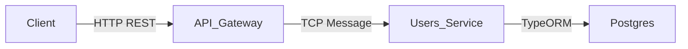
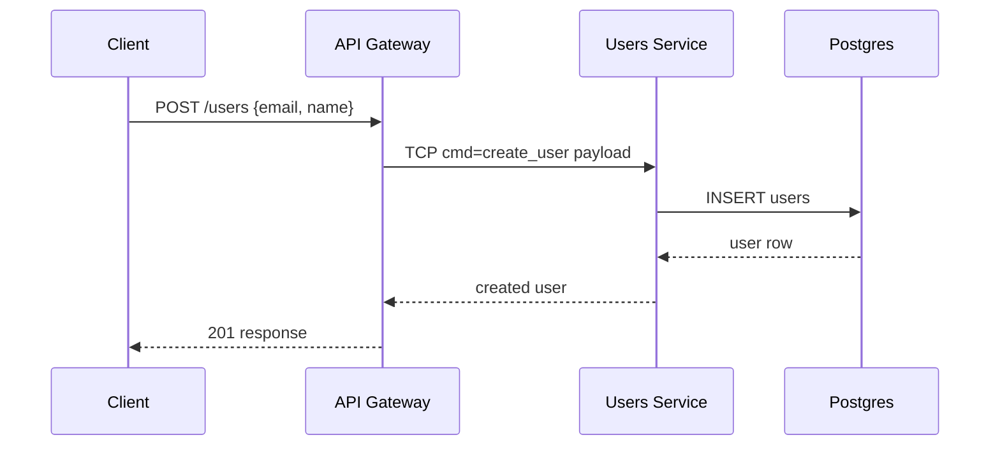
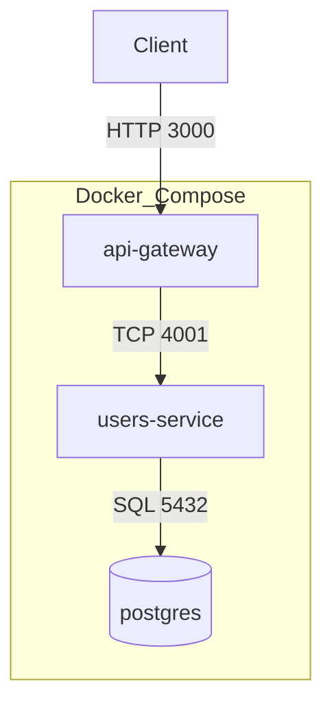
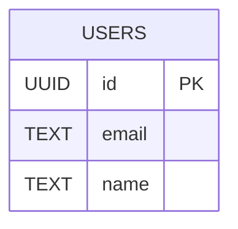

# Overview
This project demonstrates a minimal microservice-based backend using NestJS.
It is designed for interview discussion, focusing on clarity, explicit service boundaries, and straightforward communication.
The API Gateway exposes REST endpoints and delegates work to a TCP-only Users Service, which persists data in PostgreSQL via TypeORM.

# Goals
- Keep the codebase small and easy to follow
- Show clear separation of responsibilities
- Demonstrate TCP-based microservice communication
- Use explicit environment configuration
- Favor readability over production optimizations

# High-Level Architecture


# System Design Flow


# Deployment Topology


# Data Model


# Services
## API Gateway
- Exposes REST endpoints for clients
- Delegates user creation to the Users Service
- Keeps controller logic thin and avoids business logic

## Users Service
- Runs as a TCP-only microservice
- Listens for { cmd: 'create_user' } messages
- Persists users via TypeORM into PostgreSQL

# Communication
TCP transport is chosen for simplicity and low overhead.
In a production system, this could be replaced with a message broker for reliability and retries.

# Tradeoffs and Limitations
- TCP has no persistence or built-in retry guarantees
- Separate services add operational overhead
- TypeORM synchronize is used for simplicity and should be disabled in production

# Configuration
Environment variables are stored in .env files:
- Root .env for Docker port and database credentials
- api-gateway/.env for gateway and TCP client settings
- users-service/.env for TCP server and database settings

# Running with Docker
```bash
docker-compose up --build
```

# Local Development
```bash
cd api-gateway
npm install
npm run start:dev
```

```bash
cd users-service
npm install
npm run start:dev
```

# API
## Create User
POST /users

Request body:
```json
{
  "email": "jane@example.com",
  "name": "Jane Doe"
}
```

Example:
```bash
curl -X POST http://localhost:3000/users \
  -H "Content-Type: application/json" \
  -d "{\"email\":\"jane@example.com\",\"name\":\"Jane Doe\"}"
```
